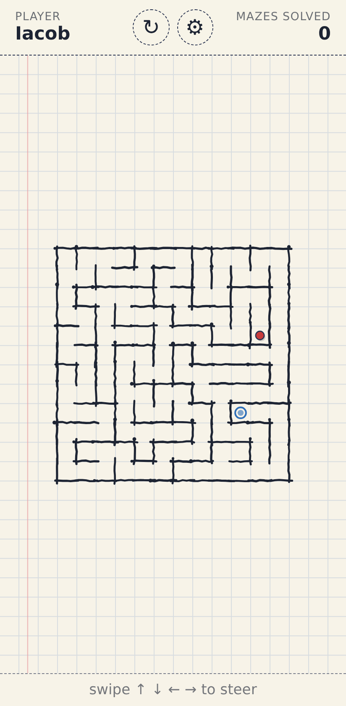
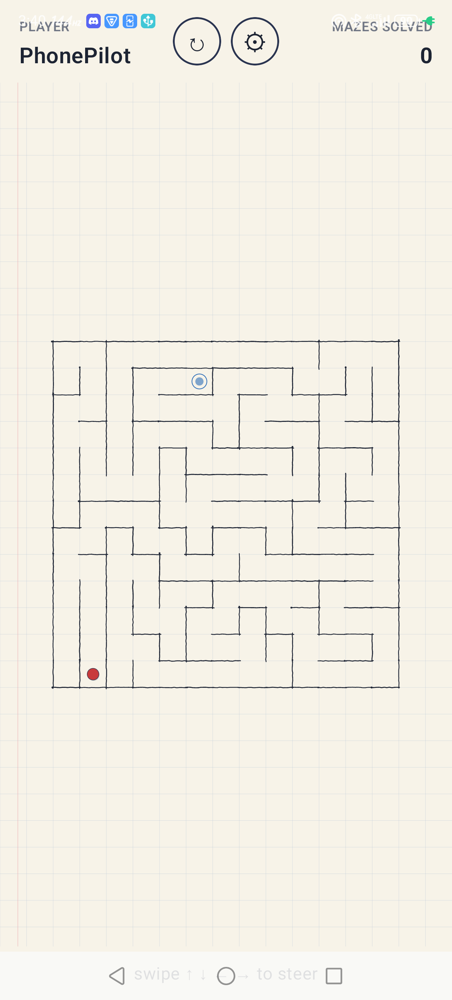

# aMazeGame

A mobile-first maze game drawn like it was sketched into a math notebook — hand-wobbled pen walls, square graph paper, a red ink dot for the player. **One Rust core, two native frontends.** The browser version and the native Android app run the *same* `.wasm` bytes; only the renderer changes per platform.

[**▶ Play it now**](https://lavazombie7404.github.io/aMazeGame/) (web, mobile-friendly) — or grab the APK from `/android` and run it natively.

<table>
  <tr>
    <th align="center">Web · Chrome on Android</th>
    <th align="center">Native Android · Kotlin + Compose + WAMR</th>
  </tr>
  <tr>
    <td></td>
    <td></td>
  </tr>
  <tr>
    <td>HTML5 Canvas, vanilla TypeScript, deployed to GitHub Pages.</td>
    <td>Jetpack Compose Canvas, Rust core via WebAssembly Micro Runtime over JNI.</td>
  </tr>
</table>

## Why this exists

Maze games are a dime a dozen. This one is interesting for two reasons:

1. **It looks like a math notebook.** Cream paper, blue square grid, faint red margin, hand-drawn pen walls — perpendicular wobble, endpoint overshoot, occasional ink pool. The aesthetic is plausibly a doodle in the back of an algebra book.
2. **It's the same game logic on two platforms.** The maze generator, the autonomous walker, the SHA-256 dedup, the visited set — all of it is a single Rust crate (`core/`) that compiles to `wasm32-unknown-unknown`. The web app instantiates that `.wasm` in the browser. The Android app hosts the *same byte-identical* `.wasm` inside the native APK via [WAMR](https://github.com/bytecodealliance/wasm-micro-runtime). No WebView. No JS shim on Android. Same RNG, same maze for the same seed.

## How it plays

- The character is a dot. It moves **autonomously** down the corridor it's in.
- It stops at every decision point — junctions, dead-ends, and the goal.
- You swipe up / down / left / right to tell it where to go next. Or use **arrows / WASD** on a keyboard.
- Reach the blue ringed goal → score++ and a new maze appears.
- Maze size is 12×12 → 17×17 (the visible math-notebook squares define the cell size), alternating between a smaller "simple" round and a larger "complex" one so you get a breather.
- Mazes never repeat on the same device. The structural SHA-256 hash of every maze ends up in storage, and the generator rejects collisions.

## Architecture in one picture

```
  ┌──────────────────────────────┐
  │       core/  (Rust)          │   maze generator · walker · RNG
  │   compiles to amaze_core.wasm│   C ABI, no wasm-bindgen
  └──────────────┬───────────────┘
                 │ same 36 KB .wasm
       ┌─────────┴──────────┐
       ▼                    ▼
  ┌──────────┐         ┌──────────────────────┐
  │  web/    │         │  android/            │
  │  Vite +  │         │  Kotlin + Compose +  │
  │  TS +    │         │  WAMR (NDK/JNI)      │
  │  Canvas  │         │                      │
  │          │         │  + Ktor HTTP puppet  │
  │          │         │  on 127.0.0.1:8088   │
  └──────────┘         └──────────────────────┘
       │                    │
       ▼                    ▼
   GitHub Pages         APK on the phone
```

Both renderers paint the math-textbook skin (cream paper, grid, hand-drawn pen walls). The web renderer is plain Canvas2D; the Android renderer is Compose `DrawScope`. The wobble RNG (Mulberry32) is seeded from the maze's structural hash so the same maze looks the same every frame, on either platform.

## A puppet API for AI agents

The native Android app embeds a tiny HTTP server on `127.0.0.1:8088` so a developer (or [Claude Code](https://www.anthropic.com/claude-code)) can drive scenarios end-to-end:

```bash
adb forward tcp:8088 tcp:8088

curl http://localhost:8088/health
# {"ok":true,"abiVersion":1,"platform":"android"}

curl http://localhost:8088/state
# {"mazeSize":13,"start":[7,5],"goal":[8,11],
#  "player":[7.0,5.0],"visitedLen":1,"hash":"91a564…"}

curl -X POST http://localhost:8088/control/swipe \
     -H content-type:application/json -d '{"direction":"E"}'

curl -X POST http://localhost:8088/control/reset \
     -H content-type:application/json -d '{"size":14,"seed":42}'
```

The web side has a parallel story: Chrome's DevTools Protocol is forwarded out of the phone over `adb forward tcp:9222 localabstract:chrome_devtools_remote`, and the `scripts/drive-phone.mjs` / `scripts/inspect-phone.mjs` Node scripts use Playwright's `connectOverCDP` to interact with the game tab the same way `curl` interacts with the Android server.

## Repository layout

```
core/                 Rust workspace member, builds amaze_core.wasm.
  src/
    rng.rs            Mulberry32 — byte-identical to the TS port.
    maze.rs           Iterative recursive backtracker + SHA-256 hash.
    movement.rs       Autonomous walker, decision-cell detection.
    lib.rs            C ABI exports consumed by both platforms.

web/                  Vite + TS + Canvas. Plays in Chrome.
  index.html
  public/core.wasm    Staged by scripts/build-core.mjs.
  src/
    main.ts           Boot, animation loop, glue.
    maze.ts movement.ts rng.ts  TS mirror of the Rust core.
                                 The web app currently runs from these;
                                 the loader in src/core/wasm.ts is wired
                                 and verified, swap is a one-line change.
    renderer.ts       Canvas2D renderer.
    skins/            math-textbook (default) + types for future skins.
    shapes/           dot, ring, square, diamond, star, flag, arrow…
    storage.ts        sql.js + IndexedDB. Player name + completed mazes.

android/              Self-contained Gradle project.
  app/src/main/
    AndroidManifest.xml         INTERNET permission for the puppet port.
    assets/core.wasm            Staged by Gradle's stageCoreWasm task.
    kotlin/com/lavazombie/amazegame/
      MainActivity.kt           Compose host + lifecycle.
      GameRuntime.kt            CoreBridge facade + StateFlow.
      CoreBridge.kt             Typed wrapper over JNI exports.
      PlayerStore.kt            SharedPreferences for name + score.
      PuppetServer.kt           Ktor on 127.0.0.1:8088.
      ui/MainScreen.kt          HUD + dialog + canvas.
      ui/MazeCanvas.kt          Pen-stroke renderer for Compose.
    cpp/
      CMakeLists.txt            FetchContents WAMR, builds libamaze_native.so.
      core_bridge.cc            JNI <-> WAMR <-> amaze_core.wasm.

docs/                 Requirements, architecture, deploy + Android debug.
scripts/              build-core.mjs, drive-phone.mjs, inspect-phone.mjs,
                      marketing-screenshots.mjs.
tests/                Playwright smoke tests against the web app.
```

## Quick start

### Run the web app locally

```bash
npm install
npm run dev               # Vite at http://localhost:5173, host 0.0.0.0
npm run build             # production build into dist/
npm run test:e2e          # Playwright across desktop + Pixel 7 viewports
```

`npm run dev` and `npm run build` both call `node scripts/build-core.mjs` first, which runs `cargo build --release --target wasm32-unknown-unknown -p amaze-core` and stages `web/public/core.wasm`.

### Run the native Android app

Prereqs (the Android SDK install in WSL is documented in [`docs/android-debug.md`](docs/android-debug.md)):

- Android SDK with `platforms;android-35`, `build-tools;35.0.0`
- Android NDK r26d (`26.3.11579264`)
- CMake 3.22.1
- Rust with `rustup target add wasm32-unknown-unknown`
- Node.js (the Gradle task delegates the WASM build to `scripts/build-core.mjs`)

```bash
cd android
./gradlew :app:assembleDebug
adb install -r app/build/outputs/apk/debug/app-debug.apk
adb shell am start -n com.lavazombie.amazegame/.MainActivity
```

To puppet the running app from the dev machine:

```bash
adb forward tcp:8088 tcp:8088
curl http://localhost:8088/health
```

### Deploy

A push to `main` triggers `.github/workflows/deploy.yml`, which installs the Rust toolchain, runs `npm run build`, and publishes `dist/` to GitHub Pages via `actions/deploy-pages`.

## Status

| Area                                            | State    |
|-------------------------------------------------|----------|
| Web app — playable, deployed                    | ✅        |
| Math-textbook skin (cream paper, grid, walls)   | ✅        |
| Skin system + shape library (rings, stars, …)   | ✅ (web)  |
| Trail of visited cells                          | ✅        |
| Per-device never-repeat mazes (SHA-256 dedup)   | ✅        |
| Simple/complex difficulty alternation           | ✅        |
| Rust → wasm32 game core                         | ✅        |
| Web `core/wasm.ts` loader + ABI handshake       | ✅        |
| Android scaffold (Gradle, Compose, NDK, WAMR)   | ✅        |
| JNI bridges, full game runs natively on Android | ✅        |
| Puppet HTTP API on Android                      | ✅        |
| Web gameplay running from the WASM core         | 🚧 toggle |
| Geometry Dash skin (Phase 2)                    | 🔮 future |
| ARMv7 + x86_64 Android builds                   | 🔮 future |
| Scenario playback (`POST /scenarios`)           | 🔮 future |

## Tech stack

**Shared.** Rust → wasm32. C ABI (no wasm-bindgen) so the same `.wasm` runs in the browser and in WAMR. SHA-256 via `sha2`.

**Web.** Vanilla TypeScript, Vite, HTML5 Canvas. `sql.js` (SQLite-WASM) for player + stats, persisted in IndexedDB. Playwright smoke tests. CI via GitHub Actions → Pages.

**Android.** Kotlin 2.0 + Jetpack Compose. WebAssembly Micro Runtime ([WAMR](https://github.com/bytecodealliance/wasm-micro-runtime)) built into the app via NDK + CMake `FetchContent`. Ktor for the puppet HTTP server. SharedPreferences for player/score.

## Background

I built this iteratively, on real hardware (a Nubia REDMAGIC 10 Pro), with Claude Code driving most of the development. The interesting bits along the way — Chrome runaway canvas growth on the phone, REDMAGIC silently disabling logcat, WAMR's signal-handler conflict with Android's debuggerd, the kotlinx-serialization compiler plugin gotcha — are all written up in [`CLAUDE.md`](CLAUDE.md) so they don't bite the next person who walks the same path. Specifically:

- [`docs/requirements.md`](docs/requirements.md) — what the game should do (PRD).
- [`docs/architecture.md`](docs/architecture.md) — how it's built across the three platforms.
- [`docs/android-debug.md`](docs/android-debug.md) — adb, usbipd-win, the polling-loop cable diagnostic, chrome://inspect, Playwright over CDP.
- [`docs/deployment.md`](docs/deployment.md) — GH Pages workflow.
- [`android/README.md`](android/README.md) — Android-specific build recipe + puppet API reference.

## License

MIT — see [`LICENSE`](LICENSE).
